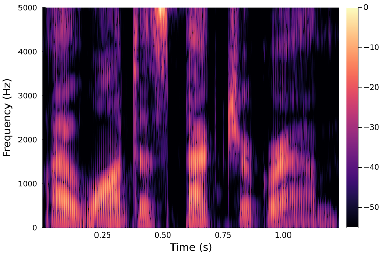

[](https://github.com/maetshju/Phonetics.jl/actions/workflows/ci.yml)

[](https://codecov.io/gh/maetshju/Phonetics.jl)

[](https://maetshju.github.io/Phonetics.jl)

[](https://zenodo.org/badge/latestdoi/267223711)  
(links to Zenodo DOI for each tagged version from v0.1.1 on for archival and referencing purposes; see license for copyright statement and repo ownership)


`Phonetics.jl` can be installed with

```julia
] add Phonetics
```

Phonetics.jl is a collection of functions that are useful for processing phonetic data. "Phonetic data" is a term used in a broad sense to include, for example, transcriptions, sound files, and acoustic measurements like formant values. Functions are added to this package over time. Most functions are described in the documentation.

As an example, a recording of the sentence "I want a spectrogram" can be plotted with the following bit of code:

```julia
using Phonetics
using WAV
s, fs = wavread("iwantaspectrogram.wav")
s = vec(s)
phonspec(s, fs)
```



If you have questions about the package, please feel free to use [the Discussions feature](https://github.com/maetshju/Phonetics.jl/discussions) on this repo.
