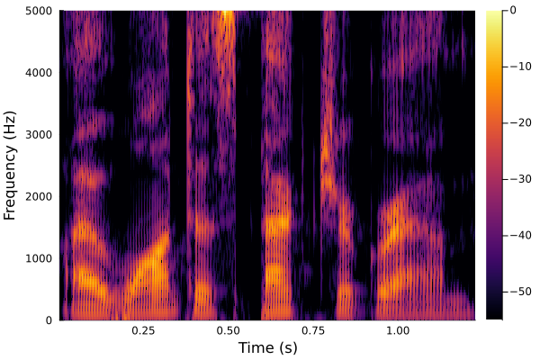

[](https://github.com/maetshju/Phonetics.jl/actions/workflows/ci.yml)

[](https://codecov.io/gh/maetshju/Phonetics.jl)

[](https://maetshju.github.io/Phonetics.jl)


Currently under development. Some function interfaces may break from time to time while in early releases.

Please note that the MFCC module is effectively a simple static link to the source code from [MFCC.jl v0.3.2](https://github.com/JuliaDSP/MFCC.jl), which is permitted under the BSD-2 license it was conveyed under. It has only been trivially modified to work with newer versions of `HDF5.jl` and to work as a statically linked library. The licenses for that code by itself are provided within the `src/MFCC` and `test/MFCC` folders. If you use the MFCC module itself from `Phonetics.jl` in your own work, please make sure to give credit as appropriate to David A. van Leeuwen, according to the license in the MFCC module folder.

The license for the `Phonetics.jl` project as a whole is given in the `LICENSE` file in the root folder. Please note that statically including the `MFCC.jl` code is currently intended as a stopgap while version compatiblity is resolved in `MFCC.jl` so that dynamic linking of it via the package manager can be retinroduced.

`Phonetics.jl` is currently unregistered. Install with

```julia
] add https://github.com/maetshju/phonetics.jl
```

Phonetics.jl is a collection of functions that are useful for processing phonetic data. "Phonetic data" is a term used in a broad sense to include, for example, transcriptions, sound files, and acoustic measurements like formant values. Functions are added to this package over time. Most functions are described in the documentation.

As an example, a recording of the sentence "I want a spectrogram" can be plotted with the following bit of code:

```julia
using Phonetics
using WAV
s, fs = wavread("iwantaspectrogram.wav")
s = vec(s)
phonspec(s, fs)
```

